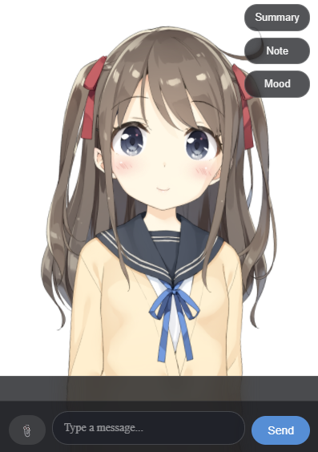
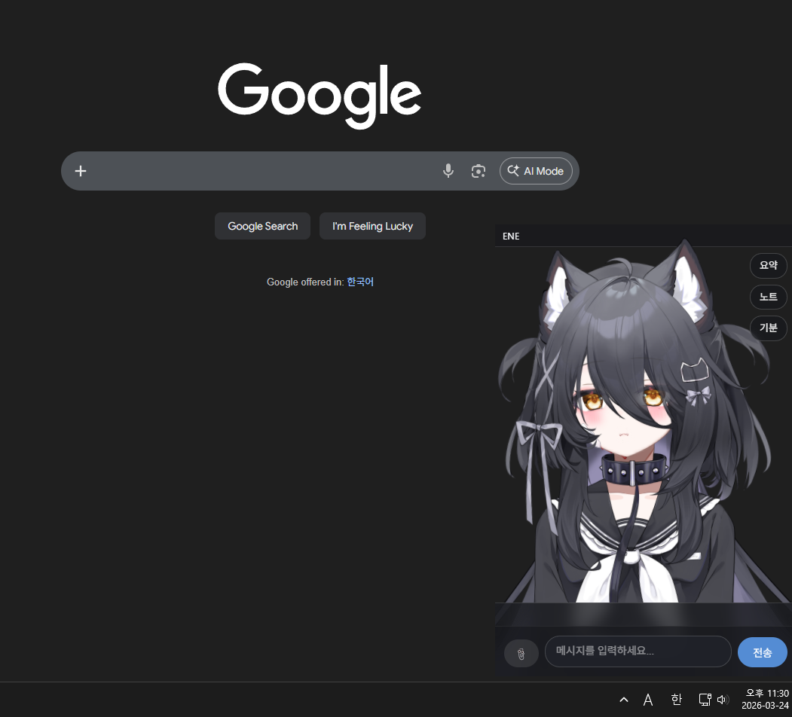

# <p align="center"></p>

<h1 align="center">ENE</h1>

<p align="center">
  Live2D 존재감을 가진 장기기억 기반 AI 데스크톱 동반자.
</p>

<p align="center">
  <a href="README.md">English</a> |
  <a href="README.ko.md">한국어</a> |
  <a href="README.ja.md">日本語</a>
</p>

<p align="center">
  
  
  
  
  
</p>

ENE는 작업 공간 위에 머무는 데스크톱 AI 파트너입니다. Live2D 오버레이, 장기기억, 개인화 프롬프트, 음성 출력, 노트, 목표, 약속, 기분 상태, 능동적 맥락을 하나의 동반자형 데스크톱 앱으로 묶습니다.

단순한 채팅 창을 목표로 하지 않습니다. ENE는 바탕화면 위의 존재감, 기억, 표정과 움직임, 필요할 때의 음성 출력, 노트와 리마인더 같은 일상 흐름을 중심에 둡니다.

> [!NOTE]
> ENE는 활발히 개발 중인 개인 프로젝트입니다. 사용할 수 있는 상태지만, 다양한 PC 환경과 공급자 조합에서 충분히 검증된 안정 버전은 아닙니다.

> [!IMPORTANT]
> 메모리 임베딩 흐름은 현재 Voyage 조합이 가장 안정적으로 테스트되었습니다. 다른 공급자는 이후 개선될 수 있습니다.

> [!TIP]
> 실용적인 기본 조합으로는 메인 LLM에 `Google Gemini`, TTS에 `GPT-SoVITS HTTP`를 추천합니다.

## 미리보기

| 데스크톱 동반자 | 채팅과 컨트롤 |
| :---: | :---: |
|  |  |

## 주요 기능

- 트레이 기반 데스크톱 앱으로 Live2D 동반자 오버레이를 표시합니다.
- 성격, 프롬프트, 메모리, 프로필, 기분 맥락을 사용해 채팅합니다.
- 이미지와 문서 첨부를 대화에 포함할 수 있습니다.
- 요약, 사실, 메타데이터, 검색 맥락을 포함한 장기기억을 저장합니다.
- 사용자 프로필과 ENE 프로필을 유지해 대화를 점점 개인화합니다.
- 여러 축의 기분 상태를 추적하고 말투, 표정 지침, UI 피드백에 반영합니다.
- ENE의 단기/장기 목표 상태를 관리합니다.
- 대화 중 생긴 약속을 기억하고 정해진 시점에 자연스럽게 다시 꺼냅니다.
- `/diary`로 일기형 내용을 저장합니다.
- `/note`로 노트 계획과 실행 흐름을 사용할 수 있습니다.
- Obsidian CLI 연동 시 선택된 파일 맥락을 프롬프트에 포함하고 제어된 노트 작업을 실행할 수 있습니다.
- 캘린더형 이벤트와 대화 활동 신호를 추출합니다.
- TTS, 브라우저 음성, 스트리밍 TTS, PTT 중단, 모델 인식 립싱크를 지원합니다.
- 긴 자리 비움 상태를 감지하고 선택적으로 먼저 말을 걸 수 있습니다.
- 설정창에서 모델, 프롬프트, 프로필, TTS, 테마, 단축키, 메모리, Obsidian, 목표, 동작을 조정합니다.

## 현재 상태

ENE는 실제 로컬 개발 흐름을 갖춘 활성 개발 프로젝트입니다.

- 기본 번들 Live2D 모델은 `hiyori`입니다.
- 사용자가 선택한 모델 경로는 재시작 후에도 유지됩니다.
- Live2D 모드와 함께 이미지 아바타 모드도 사용할 수 있으며, 감정별 이미지 전환과 이미지별 위치 조정이 가능합니다.
- `ene_goals.json`을 통해 ENE의 목표 상태를 유지할 수 있어, 단기/장기 목표 맥락을 동반자 동작에 반영할 수 있습니다.
- LLM 공급자 생성은 공급자별 모듈과 호환 facade로 분리되어 있습니다.
- 앱 시작 책임은 LLM, 메모리, TTS, 프로필 bootstrap 모듈로 나뉘어 있습니다.
- 큰 브리지 책임은 점차 더 작은 bridge mixin과 service 경계로 분리되어 안정성을 높이는 방향으로 정리되고 있습니다.
- CI는 Linux와 Windows에서 Python 3.11로 실행됩니다.
- 선별 대상 기준 커버리지 게이트는 현재 `80%`입니다.

첫 실행 안내, 패키징 릴리스, 설정 가져오기/내보내기, 공개 문서는 계속 개선 중입니다.

## 지원 언어

앱 UI 로케일은 다음 언어를 포함합니다.

- 영어
- 한국어
- 일본어

프롬프트 언어, 실제 답변 언어, TTS 언어는 선택한 공급자, 프롬프트 설정, 모델 동작에 따라 달라질 수 있습니다.

## 빠른 시작

### 1. 가상환경 생성

```powershell
python -m venv venv
.\venv\Scripts\Activate.ps1
python -m pip install --upgrade pip
pip install -r requirements.txt
pip install -r requirements-dev.txt
```

### 2. ENE 실행

```powershell
python main.py
```

ENE는 PyQt 데스크톱 앱으로 실행되며 트레이 아이콘을 사용합니다. 설정창은 트레이 아이콘을 우클릭해서 열 수 있습니다.

### 3. 공급자와 키 설정

ENE는 사용자 편집 가능한 런타임 파일을 사용자 데이터 폴더에 저장합니다.

- Windows: `%AppData%/ENE`

주요 파일:

- `config.json` - 런타임 설정과 기능 토글
- `api_keys.json` - 공급자 키와 비밀값
- `memory.json` - 장기기억 저장소
- `user_profile.json` - 사용자 프로필 사실
- `ene_goals.json` - ENE 목표 상태
- `calendar.json`, `mood_state.json`, `obs_config.json` - 보조 상태
- `prompts/*.md` - 편집 가능한 프롬프트 파일

> [!WARNING]
> 실제 비밀값은 `api_keys.json`에 두세요. 개인 API 키, 비공개 모델 자산, 메모리 파일, 프로필 파일은 커밋하지 마세요.

## 첫 설정 추천 흐름

1. `python main.py`로 ENE를 실행합니다.
2. 트레이 아이콘에서 설정창을 엽니다.
3. LLM 공급자, 모델, API 키를 설정합니다.
4. 기본 `hiyori` 모델을 그대로 쓰거나 원하는 `.model3.json` 파일을 선택합니다.
5. 선택한 Live2D 모델의 표정 이름을 확인합니다.
6. 사용자 프로필과 ENE 프로필을 채웁니다.
7. 안정적인 메모리를 원하면 Voyage 임베딩을 설정합니다.
8. 텍스트 채팅이 정상 동작한 뒤 TTS를 켜고 조정합니다.
9. 로컬 노트 작업이 필요할 때만 Obsidian CLI 연동을 켭니다.

## 권장 공급자 설정

ENE와 잘 맞는 간단한 시작 조합은 아래와 같습니다.

- `LLM 공급자`: `Google Gemini API`
- `TTS 공급자`: `GPT-SoVITS HTTP`
- `임베딩 공급자`: `Voyage`

이 조합은 설정 난이도를 비교적 낮게 유지하면서도, 일반 대화 품질, 메모리 안정성, 캐릭터다운 음성 흐름을 함께 확보하기 좋습니다.

LLM 쪽은 설정창에서 `Google Gemini API`를 선택하고 Gemini API 키를 입력한 뒤, 특별한 이유가 없다면 기본 Gemini 모델부터 시작하는 것을 권장합니다.

TTS 쪽은 ENE 안에서 음성 출력을 테스트하기 전에 GPT-SoVITS 서버가 먼저 실행 중인지 확인하세요.

## GPT-SoVITS 빠른 설정

GPT-SoVITS는 ENE에 잘 맞는 TTS 경로입니다. 기본적인 일반 TTS보다 더 캐릭터다운 느낌을 만들기 쉽고, ENE를 단순 도우미가 아니라 동반자처럼 느끼게 만드는 데 유리합니다.

ENE가 GPT-SoVITS로 말하게 하고 싶다면:

1. 먼저 GPT-SoVITS HTTP 서버를 실행합니다.
2. ENE를 열고 트레이 아이콘에서 설정창으로 들어갑니다.
3. TTS 섹션에서 공급자를 `GPT-SoVITS HTTP`로 선택합니다.
4. `API URL`에 서버 주소를 입력합니다.
5. `Reference Audio Path`에 유효한 참조 음성 파일 경로를 넣습니다.
6. `Reference Text`에 그 참조 음성에 맞는 텍스트를 입력합니다.
7. 참조 언어와 대상 언어 값을 확인한 뒤 설정을 저장합니다.
8. 먼저 일반 텍스트 채팅과 기본 음성 재생이 정상 동작하는지 확인하고, 그 다음 추가 옵션을 하나씩 켜는 것을 권장합니다.

처음 결과를 좋게 만들려면, 짧고 깨끗한 참조 음성을 쓰고 그 내용과 정확히 일치하는 참조 텍스트를 넣는 것이 중요합니다. 참조 음성, 참조 텍스트, 언어 설정이 서로 어긋나면 음질이나 안정성이 빠르게 나빠지는 경우가 많습니다.

ENE의 현재 기본 동반자 분위기에 가장 자연스럽게 맞추고 싶다면, GPT-SoVITS에서도 우선 일본어 기준으로 시작하는 것이 가장 편합니다.

### 스트리밍 모드 켜기

스트리밍 모드를 켜려면 TTS 설정에서 `GPT-SoVITS 스트리밍 TTS 사용` 옵션을 활성화하세요.

스트리밍은 전체 음성 결과를 모두 기다리지 않고 조금 더 빨리 말하기 시작할 수 있어서, ENE의 응답이 더 즉각적으로 느껴질 수 있습니다. 특히 짧게 주고받는 대화에서 체감이 좋은 편입니다.

다만 먼저 일반 GPT-SoVITS 재생이 안정적으로 되는지 확인한 뒤 스트리밍을 켜는 것을 권장합니다. 기본 비스트리밍 경로가 안정적일 때 스트리밍 문제도 훨씬 쉽게 구분할 수 있습니다.

### GPT-SoVITS 설정에서 자주 막히는 부분

- `아예 소리가 안 남`: GPT-SoVITS 서버가 실행 중이 아니거나, `API URL`이 틀렸거나, 실제 TTS 공급자가 `GPT-SoVITS HTTP`로 선택되지 않은 경우가 많습니다.
- `음성이 이상하거나 불안정함`: 참조 음성, 참조 텍스트, 언어 설정이 서로 충분히 맞지 않는 경우가 흔합니다.
- `텍스트 답변은 나오는데 말은 안 함`: 공급자 설정만 맞고 TTS 자체 활성화가 꺼져 있는 경우를 확인하세요.
- `스트리밍이 끊기거나 지연됨`: 먼저 스트리밍을 끄고 일반 재생이 안정적인지 확인한 뒤, 다시 스트리밍을 켜서 비교해보는 편이 좋습니다.
- `음질이 약함`: 더 깨끗한 참조 음성, 더 정확한 참조 텍스트, 샘플과 정확히 맞는 언어 값을 다시 써보는 것이 좋습니다.
- `말은 하는데 ENE답지 않음`: `sub_prompt_body.md`에서 spoken style을 조정한 뒤 TTS 설정도 함께 다시 보는 것을 권장합니다.

## 이미지 아바타 모드

ENE는 Live2D 모델 외에도 이미지 아바타 모드를 사용할 수 있습니다. 동일한 캐릭터의 여러 감정 이미지를 폴더에 넣어 두고, 설정창에서 아바타 모드를 `image`로 바꾸면 정적인 이미지 기반 동반자로 표시됩니다. 생성 이미지처럼 매번 완전히 같은 Live2D 자산을 만들기 어려운 작업 흐름에 특히 적합합니다.

이미지 폴더는 감정별 파일명으로 준비합니다. `normal` 이미지는 필수이며, 예를 들어 `normal.png`, `happy.png`, `sad.png`, `angry.webp`처럼 영어 감정 키를 파일명으로 사용합니다. 지원 확장자는 `.png`, `.webp`, `.jpg`, `.jpeg`입니다.

등록된 감정 파일명은 내부 프롬프트의 사용 가능 감정 목록에 반영됩니다. 따라서 폴더에 실제로 있는 감정만 모델이 선택하도록 안내할 수 있습니다.

설정창에서는 이미지 폴더를 선택하고, 감정별 이미지를 미리 보면서 각 이미지의 scale, x, y 위치를 독립적으로 조절할 수 있습니다. TTS 중 말하는 상태는 입 모양 이미지를 바꾸는 방식이 아니라 아바타가 위아래로 살짝 움직이는 방식으로 표현됩니다.

## 프롬프트 파일

ENE는 Python 코드를 바꾸지 않고 캐릭터 행동을 조정할 수 있도록 Markdown 프롬프트 파일을 사용합니다.

기본 위치:

- Windows: `%AppData%/ENE/prompts`

핵심 파일:

- `base_system_prompt.md` - ENE의 정체성, 관계, 핵심 행동
- `sub_prompt_body.md` - 말투와 추가 행동 규칙
- `emotion_guides.md` - 표정 키와 사용 지침
- `analysis_system_appendix.md` - 선택적인 내부 분석 지침

일반 채팅은 기본 프롬프트, 생성된 런타임 계약, 보조 프롬프트 본문, 모델 인식 표정 지침, 선택적 분석 appendix를 조합합니다. `/note` 계획 흐름은 더 제한된 맥락을 사용하므로 일반 보조 프롬프트 경로와 다르게 동작합니다.

## 음성, TTS, 립싱크

ENE는 여러 음성 경로를 지원합니다.

- GPT-SoVITS 계열 HTTP TTS
- OpenAI 호환 audio speech
- ElevenLabs
- 브라우저 speech synthesis
- 지원되는 경우 스트리밍 TTS

앱은 화면 응답, 오디오 재생, Live2D 입 움직임의 시작 시점을 맞추려고 합니다. 입 파라미터가 풍부한 모델에서는 모델 인식 립싱크 프로필과 viseme blending을 사용할 수 있고, 단순 모델에서는 기본 입 열림 방식으로 폴백합니다.

PTT는 ENE가 말하는 중에도 현재 TTS를 끊고 입력을 시작할 수 있게 합니다.

## 노트와 Obsidian

ENE에는 두 가지 노트 지향 명령이 있습니다.

- `/diary` - 일기형 로컬 작성
- `/note` - 계획과 실행 기반 노트 작업

Obsidian CLI 연동을 켜면 선택된 파일을 확인하고, 해당 맥락을 프롬프트에 넣고, 설정된 흐름을 통해 제어된 노트 작업을 실행할 수 있습니다.

## 프로젝트 구조

```text
main.py                     PyQt 진입점과 런타임 프리로드
src/core/app.py             애플리케이션 조립
src/core/app_*_bootstrap.py LLM, 메모리, TTS, 프로필 시작 헬퍼
src/core/bridge.py          QWebChannel 브릿지 facade
src/core/bridge_mixins/     브릿지 기능 영역
src/ai/                     LLM, 메모리, 프롬프트, 프로필, 목표, 기분
src/ui/                     설정창과 데스크톱 UI 헬퍼
assets/web/                 Live2D 웹 런타임
assets/live2d_models/       번들 가능한 모델 자산
scripts/                    setup과 release 스크립트
tests/                      회귀 테스트와 단위 테스트
```

현재 구조는 `app.py`를 조립 코드에 가깝게 유지하고, 시작 책임을 bootstrap 모듈로 분리합니다. `WebBridge`는 QWebChannel 통합 지점이며, 기능별 동작은 bridge mixin과 service 모듈로 나뉩니다.

## 개발

개발 의존성 설치:

```powershell
pip install -r requirements-dev.txt
```

빠른 문법/정적 검사:

```powershell
python -m ruff check . --select E9,F63,F7,F82
```

CI와 같은 커버리지 게이트:

```powershell
python -m coverage run --source=src --omit="src/core/app.py,src/core/audio_player.py,src/core/global_ptt.py,src/core/overlay_window.py,src/core/bridge_workers.py,src/core/bridge_mixins/attachments.py,src/core/bridge_mixins/away.py,src/core/bridge_mixins/memory_summary.py,src/core/bridge_mixins/mood.py,src/core/bridge_mixins/obsidian.py,src/ui/drag_bar.py,src/ui/settings_dialog_hotkeys.py,src/ui/settings_dialog_profile.py,src/ui/settings_dialog_prompt.py,src/ui/settings_dialog_theme.py,src/ui/settings_dialog_tts.py,src/ui/settings_dialog_widgets.py,src/ai/http_llm_clients.py,src/ai/http_llm_common.py,src/ai/http_llm_openai.py,src/ai/http_llm_custom_providers.py,src/ai/http_llm_anthropic.py,src/ai/http_llm_ollama.py,src/ai/llm_client.py" -m pytest -q
python -m coverage report --show-missing --skip-empty --fail-under=80
```

유지되는 테스트 가이드와 집중 회귀 묶음은 [TESTING.md](TESTING.md)를 참고하세요.

## 웹 런타임 자산

저장소에는 데스크톱 오버레이에 필요한 Live2D 웹 런타임 자산이 포함되어 있습니다. 생성된 웹 라이브러리를 새로 고쳐야 한다면 다음을 실행합니다.

```powershell
python scripts/setup_web_libs.py
```

## Windows 릴리스 빌드

로컬에서 portable Windows 릴리스를 빌드합니다.

```powershell
python -m pip install --upgrade pip
pip install -r requirements-dev.txt
python scripts/build_windows_release.py --version v0.1.0
```

빌드는 `release/` 아래에 `ENE.exe`와 번들 런타임 파일을 포함한 zip을 만듭니다.

공개 릴리스에 포함하는 안전한 기본 자산:

- `assets/icons`
- `assets/web`
- `assets/live2d_models/hiyori`

개인 Live2D 구매 자산, 비공개 참조 오디오, 공급자 키, 메모리 파일, 프로필 데이터는 공개 릴리스 번들 밖에 두어야 합니다.

## 로드맵

- 첫 실행 온보딩과 설정 검증 개선
- 패키징된 데스크톱 릴리스 다듬기
- 설정, 프롬프트, 프로필, 메모리 가져오기/내보내기
- 메모리 제어 개선과 Memory 2.0 JSON 저장소의 SQLite 전환
- 표정 선택과 능동적 대화 타이밍 개선
- 공급자 설정 안내 강화
- 안정성에 도움이 되는 범위에서만 큰 bridge/runtime 표면 축소

## 서드파티 라이선스

- ENE는 웹 UI의 여러 컨트롤에서 `paperclip`, `pencil`, `rotate-ccw` 같은 Lucide SVG 아이콘을 인라인으로 사용합니다.
- 이 아이콘은 프로젝트 UI에서 직접 사용되며 Forui framework를 통해 제공되지 않습니다.
- Lucide 아이콘은 ISC License로 배포됩니다.
- 이 아이콘 자산이나 수정된 SVG markup을 재배포할 때는 적절한 upstream attribution과 license notice를 유지하세요.
