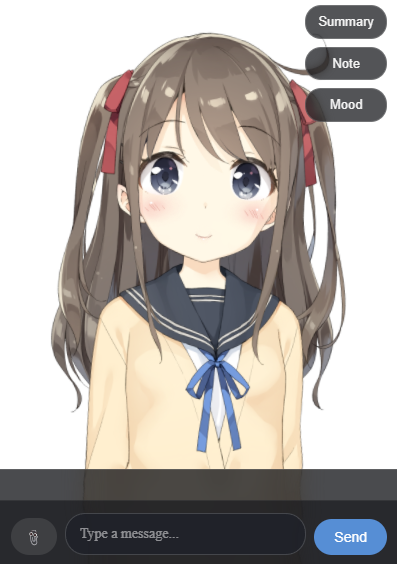
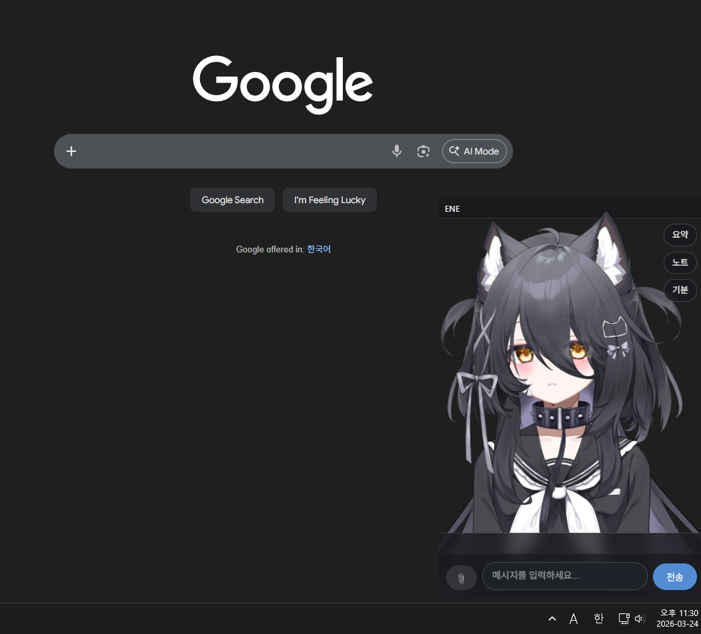

# <p align="center"></p>

<h1 align="center">ENE</h1>

<p align="center">
  A memory-aware AI desktop companion with a Live2D presence.
</p>

<p align="center">
  
  
  
  
</p>

ENE is a desktop AI partner that stays on top of your workspace, chats with you through a dedicated on-screen interface, remembers context over time, and connects everyday interaction to notes, mood tracking, and personal memory flows.

It is designed as a personal companion rather than a plain chat window: something that feels present on your desktop, responds with personality, and becomes more useful as your daily context accumulates.

> [!NOTE]
> ENE is still a personal project under active development. It has not been tested broadly across different environments yet, so depending on your setup, you may run into instability or unexpected errors.

> [!IMPORTANT]
> The embedding workflow has only been tested with Voyage so far. If you want the most reliable setup, it is strongly recommended to issue a Voyage API key and use a Voyage embedding model.

## Preview

| Preview | Preview |
| :---: | :---: |
|  |  |

<p align="center">
  Current in-app desktop UI with quick actions, message input, settings access, and Live2D companion view.
</p>

## Why ENE?

- A desktop-native AI companion instead of a browser-only chat tool
- Live2D overlay presence with a dedicated app lifecycle and tray behavior
- Memory-aware interaction with notes, mood state, diary data, and profile context
- Voice-ready architecture with TTS, STT runtime preload, and lip-sync support
- Built for practical daily workflows, not only demo conversations

## Supported Languages

ENE currently includes interface translations for:

- English
- Japanese
- Korean

In practice, this means the app UI and settings experience can be used in those languages. Actual conversation language, tone, and voice output can still vary depending on the model, prompt, and provider settings you choose.

## What You Can Do With ENE

- Keep ENE visible on your desktop as a Live2D-based companion instead of opening a separate chat page every time you want to interact.
- Chat with ENE through the main on-screen interface while using memory, master-related settings, and profile context to make conversations feel more personal over time.
- Save notes, summaries, and diary-style content as part of your daily workflow instead of treating conversations as disposable.
- Use quick actions such as summary, note, mood-related controls, and calendar-related support directly from the main experience.
- Configure your own character setup, including Live2D model path, expressions, prompt tone, and companion behavior.
- Open the settings window from the tray icon and adjust important options without manually editing raw files.
- Use voice-related features such as push-to-talk and TTS-ready interaction if you want ENE to feel more like a spoken desktop companion.
- Connect ENE to an Obsidian-based workflow, including Obsidian CLI integration for note and diary usage.
- Let ENE detect long periods of inactivity, compare screen captures for activity changes, and proactively speak first when it thinks you have been away.

## Still Improving

- First-run onboarding and simpler initial setup
- Packaged desktop release workflow
- More polished public-facing documentation

## Getting Started

### 1. Create a virtual environment

```powershell
python -m venv venv
.\venv\Scripts\Activate.ps1
python -m pip install --upgrade pip
pip install -r requirements.txt
pip install -r requirements-dev.txt
```

### 2. Prepare configuration

ENE uses several JSON files at the project root:

- `config.json` for runtime settings and feature toggles
- `api_keys.json` for secrets and provider keys
- `user_profile.json` for user-specific profile data
- `memory.json` for long-term memory storage
- `calendar.json`, `mood_state.json`, `obs_config.json` for supporting state

At minimum, review these before running:

- LLM provider and model selection
- API keys for the selected LLM provider
- Embedding provider key
- TTS provider settings if voice output is enabled
- Live2D model path

> [!WARNING]
> Keep real secrets in `api_keys.json`, not in `config.json`, and do not commit personal keys to the repository.

### 3. Verify web runtime assets if needed

The repository already includes web assets for Live2D rendering. If you need to refresh the JavaScript runtime files, run:

```powershell
python setup.py
```

### 4. Run ENE

```powershell
python main.py
```

When launched, ENE starts as a desktop application with tray behavior and overlay-oriented UI flow.

### 5. Open the settings window from the tray icon

After ENE is running, right-click the tray icon to open the settings window. This is the easiest place to adjust the model, prompt, profile, and behavior settings without editing files by hand.

## Recommended First-Time Setup

If this is your first time using ENE, the following setup flow is recommended:

1. Open the settings window from the tray icon.
2. Set your Live2D model path so ENE loads the character you want to use.
3. Add or organize expressions that match your model so reactions feel natural.
4. Write or refine the ENE prompt so the assistant speaks and behaves the way you want.
5. Fill in master-related settings and profile information so ENE has a better understanding of who it is talking to.
6. Set up your API keys, especially your Voyage embedding key if you want the most reliable memory setup.

These steps are not mandatory, but they are highly recommended if you want ENE to feel more personal and stable from the beginning.

## First-Time Setup Tips

- `Included model`: ENE already includes the `hiyori` model, so you can start there if you just want to get the app running.
- `Recommended model setup`: For a more personal setup, it is recommended to purchase and use another Live2D model from marketplaces such as [BOOTH](https://booth.pm/).
- `Live2D model`: Pick the model JSON path first. It affects how ENE appears, moves, and responds on screen.
- `Expressions`: If your purchased model already includes emotion files, organize those first. If it does not, you can create expression files through VTube Studio and use those to improve emotional feedback in ENE.
- `ENE prompt`: Spend a little time writing the prompt that defines ENE's personality and behavior. This has a big impact on how the companion feels in daily use.
- `Master settings`: It is a good idea to fill in your master-related information and profile details early. ENE becomes more useful when it has some stable context about you.
- `Embedding`: Voyage is the safest choice for now because that is the provider this project has actually been tested with.

## Configuration Notes

The settings window already covers most of what you will want to change in normal use, including:

- model selection and provider-specific parameters
- TTS provider switching
- embedding model configuration
- global PTT behavior
- Obsidian CLI integration settings
- Live2D model placement and scale

You can use ENE without touching most internals, but if something does not behave the way you expect, the settings window is the first place to check before editing the raw configuration files.

## Roadmap

Short-term priorities that would make ENE feel more complete as a product:

- improve first-run setup and configuration guidance
- add better README visuals and usage walkthroughs
- improve stability across different environments
- add internet search capabilities
- make the initial prompt and profile setup easier to understand
- keep polishing the companion experience around memory, mood, and notes

Longer-term, ENE is aiming toward a more polished, memory-aware, voice-capable desktop companion experience that feels persistent, personal, and genuinely useful during daily work.
